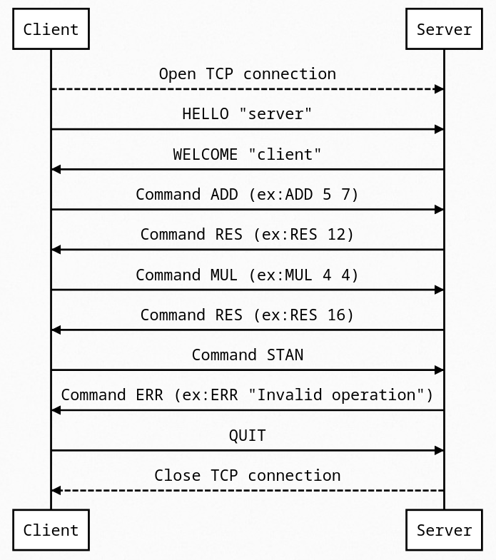

# Protocol Specification

## Purpose

This protocol is designed to allow a client to request mathematical computations from a server, which will process these requests and return results or error messages.
### Overview of Protocol

The protocol uses TCP to facilitate communication between the client and server, employing text-based messages for all interactions.
### Communication Process

**Connection Initiation**: 
- The client initiates a connection to the server over TCP.

**Welcome Message**: 
- Upon successful connection, the server sends an introductory message outlining all available operations.

**Computation Request**:
- The client submits a message specifying the desired calculation.
- If the server receives a well-formed request, it performs the calculation and responds with the result.
- If the request contains errors, the server replies with an error message describing the issue.

**Continuation or Termination**:
- The client may either continue submitting further calculation requests, or it may choose to close the connection with the server.

### Communication process flow

### Message Format

All messages exchanged between the client and server are in plain text format. Each message consists of a single line of text, terminated by a newline character (`\n`).

#### Client-to-Server Messages

**Request Message Format**:
- The client sends a request message to the server in the following format:
  - `<operation> <operand1> <operand2>`
  - `<operation>`: The operation to be performed (ex: `ADD`, `SUB`, `MUL`, `DIV`).
  - `<operand1>`: The first operand for the operation.
  - `<operand2>`: The second operand for the operation.
- Example Request Messages:
  - `ADD 10 20`
  - `MUL 5 6`
- If the client sends an invalid request message, the server responds with an error message.
- Example Invalid Request Message:
  - `ADD 10` (missing operand)
  - `DIV 20 0` (division by zero)
  - `SUB 10 abc` (non-numeric operand)
  - `MOD 10 5` (unsupported operation)
  - `ADD 10 20 30` (extra operand)
  - `ADD 10 20a` (additional character in the message)
- The server responds to invalid requests with an error message in the following format:
  - `ERR <error_message>`
  - `<error_message>`: A description of the error encountered by the server.
- Example Error Messages:
  - `ERR Invalid request format`
  - `ERR Division by zero`
  - `ERROR Non-numeric operand`

